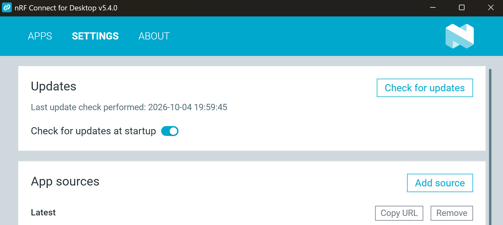
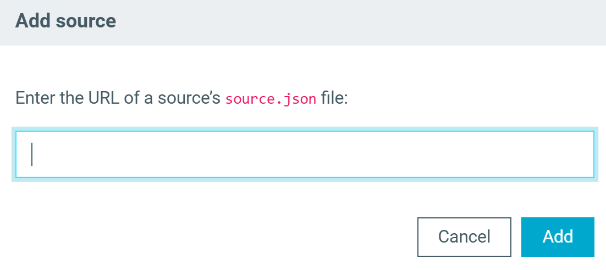
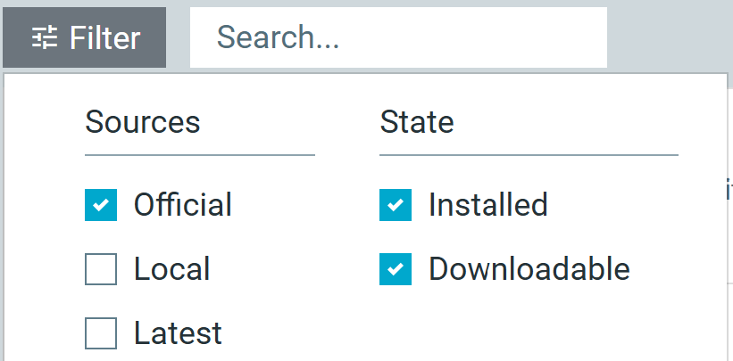
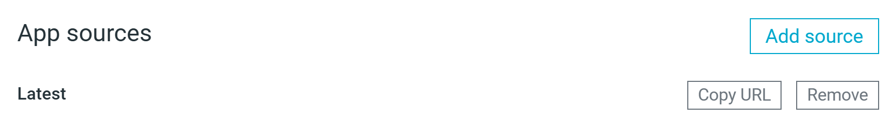

# Working with app sources

App sources are lists of nRF Connect for Desktop apps that the launcher can install and update.
Each app source is defined by a `source.json` file hosted at a specific URL.
The launcher reads this file to get the list of apps and app versions available in the source.

By default, the launcher includes the following app sources:

- **Official** - Apps released publicly by Nordic Semiconductor.
- **Local** - Apps that you installed manually from local files.

You can add more app sources, for example to get early versions of apps under development or apps that are not publicly available.
Some of these sources are restricted and require an [identity token](working_with_authentications_tokens.md).

You manage app sources in the **App sources** section of the **Settings** tab.



## Adding an app source

Before you start, get the URL of the source's `source.json` file, for example from your Nordic Semiconductor contact.
The URL must point directly to the `source.json` file and use the following format:

```
https://files.nordicsemi.com/artifactory/swtools/<access_level>/ncd/apps/<source_name>/source.json
```

In this format:

- `<access_level>` is the access level of the source, for example `external` for public sources.
  Sources with other access levels are restricted and require an identity token.
- `<source_name>` is the name of the source, for example `official`.

If you provide a legacy URL from `developer.nordicsemi.com`, the launcher replaces it with the corresponding URL on `files.nordicsemi.com`.

Complete the following steps:

1. In nRF Connect for Desktop, go to the **Settings** tab.
2. In the **App sources** section, click **Add source**.<br/>
   The **Add source** dialog box opens.

    

3. Enter the URL of the source's `source.json` file.
4. Click **Add**.<br/>
   If the source is restricted and you have not set an identity token yet, the **Missing token** dialog box opens.
   Paste your identity token and click **Set token** to continue adding the source.

The source is listed in the **App sources** section and its apps are listed in the **Apps** tab.

!!! note "Note"
      If the launcher rejects your token with the `Encryption not available` error, nRF Connect for Desktop cannot access the safe storage of your operating system.
      For more information, see [Setting a token](working_with_authentications_tokens.md#setting-a-token).

## Selecting an app source

To list the apps from a specific app source, complete the following steps:

1. In nRF Connect for Desktop, go to the **Apps** tab.
2. Click **Filter**.<br/>
   The filter menu opens.

    

3. In the **Sources** column, select the checkboxes of the app sources you want to list.
4. Click **Filter** again to close the menu.

The **Apps** tab lists the apps from the selected app sources. You can also use the **State** column to narrow down the list further. For more information, see the [Filter](overview_cfd.md#filter) section.

## Removing an app source

!!! warning "Caution"
      Removing an app source also uninstalls all the apps you installed from this source.

Complete the following steps:

1. In nRF Connect for Desktop, go to the **Settings** tab.
1. In the **App sources** section, click **Remove** next to the source you want to remove.

    

    The **Remove app source** dialog box opens.

1. Click **Yes, remove** to confirm.

The source is removed from the launcher and its apps are removed from your computer.
