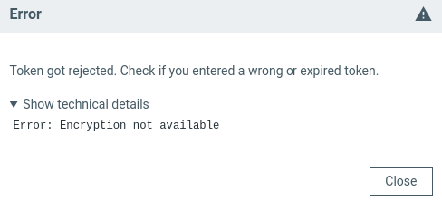

# Working with identity tokens

Identity tokens in nRF Connect for Desktop are used to verify your access rights to restricted Nordic Semiconductor [app sources](overview_cfd.md#app-sources). These tokens are required for accessing certain proprietary or early-access applications that are not publicly available.

## Generating a new token

Complete the following steps:

1. Log in to the [Nordic Semiconductor JFrog portal](https://files.nordicsemi.com/) using the account set up by Nordic Semiconductor.<br/>
   If you are a company employee, you can log in directly. Otherwise, you need to ask your Nordic contact for an account, for example on [DevZone](https://devzone.nordicsemi.com/).
2. In **User Menu**, click **Edit Profile**.<br/>
   The **User Profile** page opens.

    

3. Click **Generate an Identity Token**.
4. Optionally, add description to identify the token later on.
5. Copy the token from the **Reference Token** field.<br/>
   This token will be used in the step 3 of the [Setting a token](#setting-a-token) procedure below.

## Setting a token

Complete the following steps:

1. In nRF Connect for Desktop, go to the **Settings** tab.
2. In the **Authentication** section, click **Set token**.
3. If prompted about using confidential information from safe storage, allow the access.<br/>
   Safe storage is the location where the token is kept encrypted. For more information, see [safeStorage](https://www.electronjs.org/docs/latest/api/safe-storage) in the Electron documentation.
4. Paste your token in the dialog box.<br/>
   This is the token you got in the [Generating a new token](#generating-a-new-token) procedure.
5. Click **Set**.

Once set, your authentication information will be displayed in the **Authentication** section:


!!! info "Tip"
      Make sure to [add an app source](working_with_app_sources.md) to see the restricted app versions and [select them](working_with_app_sources.md#selecting-an-app-source).

### Fixing encryption error

When you set a token, the launcher might reject it with the following error:



This error means that nRF Connect for Desktop cannot access the safe storage of your operating system, so it cannot store the token encrypted.
This happens, for example, when you denied the access in step 3 of [Setting a token](#setting-a-token) or when your operating system has no supported secret storage available.

To fix this error, complete the following steps:

1. Make sure that the safe storage is available on your operating system:

    - On Linux, install GNOME Keyring and the libsecret libraries by running the following command:

        ```
        sudo apt install gnome-keyring libsecret-1-0 libsecret-tools
        ```

    - On macOS, the safe storage is the built-in Keychain, so you do not need to install anything.
      If your login keychain is locked, unlock it by running the following command:

        ```
        security unlock-keychain ~/Library/Keychains/login.keychain-db
        ```

    - On Windows, the safe storage is built into the operating system, so this error is not expected.
      If it occurs, contact your Nordic Semiconductor representative.

2. Restart nRF Connect for Desktop.
3. If prompted about using confidential information from safe storage, allow the access.
4. [Set the token](#setting-a-token) again.

## Replacing a token

If you need to update your token, for example when your current token is about to expire, complete the following steps:

1. [Generate a new token](#generating-a-new-token).
2. Go to the **Settings** tab.
3. In the **Authentication** section, click **Replace token**.
4. Paste your new token in the dialog box.
5. Click **Replace**.

The current token will be replaced with the new one.

## Removing a token

Complete the following steps:

1. Go to the **Settings** tab.
2. In the **Authentication** section, click **Remove**.
3. Review the warning message.
4. Click **Remove token** to confirm.

### Important considerations when removing a token

When you remove an identity token:

- You will no longer be able to add restricted app sources from Nordic Semiconductor.
- If you have existing restricted app sources added, updating these sources will lead to errors.
- You will be unable to install apps from restricted app sources.

## Troubleshooting

If you encounter errors when accessing restricted app sources, check the following points:

* Token is valid and has not expired.
* You have an active internet connection.
* You have the correct permissions to access the specific resources.

If problems persist, generate a new token or contact your Nordic Semiconductor representative for assistance.
